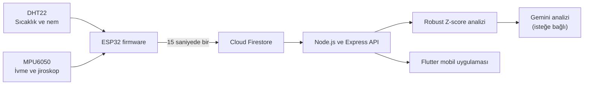

# Sentinel — ESP32 IoT Anomali İzleme Sistemi

Sentinel; ESP32 üzerinde çalışan sıcaklık, nem, ivme ve jiroskop sensörlerinden veri toplayan, ölçümleri Cloud Firestore'da saklayan, Robust Z-score yöntemiyle anomali analizi yapan ve sonuçları Flutter mobil uygulamasında görselleştiren bir IoT izleme sistemidir.

## Özellikler

- DHT22 ile sıcaklık ve nem ölçümü
- MPU6050 ile üç eksenli ivme ve jiroskop ölçümü
- Ölçümlerin 15 saniyede bir Cloud Firestore'a gönderilmesi
- Wi-Fi bağlantısı kesildiğinde kontrollü yeniden bağlanma
- NTP ile zaman senkronizasyonu
- Son 240 ölçümün yaklaşık bir saatlik grafik geçmişi olarak gösterilmesi
- Sıcaklık, nem, ivme ve jiroskop için sabit ve karşılaştırılabilir grafik ölçekleri
- Grafik noktalarında değer, eksen ve ölçüm zamanı gösterimi
- Son 60 ölçüm üzerinden Robust Z-score anomali analizi
- İlk 20 ölçümün referans, sonraki 40 ölçümün analiz verisi olarak kullanılması
- Gemini ile isteğe bağlı yapay zekâ destekli anomali yorumu
- ESP32 çevrimdışı olduğunda son Firestore verilerinin gösterilmeye devam etmesi
- Türkçe ve İngilizce mobil uygulama desteği

## Sistem Mimarisi



Veri akışı:

1. ESP32 sensörleri okur ve ölçüme yerel bir zaman damgası ekler.
2. Ölçüm `devices/{deviceId}/readings` koleksiyonuna yazılır.
3. Node.js backend, Firestore verilerini mobil uygulamaya REST API üzerinden sunar.
4. Mobil uygulama açılışta son 240 ölçümü yükler ve grafiklerde eski → yeni sırasıyla gösterir.
5. Anomali analizi aynı sorgudaki en yeni 60 ölçüm üzerinden yapılır.
6. Uygulama açıkken en güncel ölçüm 15 saniyede bir yenilenir.

## Kullanılan Teknolojiler

| Katman | Teknolojiler |
|---|---|
| Donanım | ESP32, DHT22, MPU6050 |
| Firmware | Arduino, PlatformIO, FirebaseClient |
| Veritabanı | Google Cloud Firestore |
| Backend | Node.js, Express, Firebase Admin SDK |
| Anomali analizi | Robust Z-score, medyan ve MAD |
| Yapay zekâ | Google Gemini API |
| Mobil uygulama | Flutter, Dart, `fl_chart` |
| Yerelleştirme | Flutter localization, Türkçe ve İngilizce |

## Proje Yapısı

```text
ESP32-IoT-Anomaly/
├── backend/                  # REST API ve anomali analizi
│   ├── index.js
│   ├── anomalyDetector.js
│   └── package.json
├── firmware/                 # ESP32 PlatformIO projesi
│   ├── include/
│   ├── src/main.cpp
│   └── platformio.ini
├── mobile_app/               # Flutter mobil uygulaması
│   ├── assets/
│   ├── lib/
│   │   ├── core/
│   │   ├── models/
│   │   ├── screens/
│   │   ├── services/
│   │   └── widgets/
│   ├── test/
│   └── pubspec.yaml
└── README.md
```

## Firestore Veri Yapısı

Ölçümler aşağıdaki belge yolunda tutulur:

```text
devices/{deviceId}/readings/{readingId}
```

Örnek ölçüm belgesi:

```json
{
  "device_id": "ESP32_Sensor_Node_001",
  "timestamp": "2026-08-14T00:52:13",
  "temperature": 29.5,
  "humidity": 44.8,
  "accel_x": 17068,
  "accel_y": 196,
  "accel_z": -1604,
  "gyro_x": -344,
  "gyro_y": -166,
  "gyro_z": 204
}
```

## Anomali Analizi

Backend, son 60 ölçümü kronolojik sıraya çevirir. İlk 20 ölçüm referans kümesi olarak kullanılır; sonraki 40 ölçüm önceki verilerle karşılaştırılır.

Her sensör alanı için:

1. Referans değerlerin medyanı hesaplanır.
2. Medyandan mutlak sapmaların medyanı (MAD) hesaplanır.
3. Robust Z-score değeri hesaplanır:

```text
Robust Z-score = 0.6745 × (değer - medyan) / MAD
```

Mutlak Robust Z-score değeri `5` sınırını aşarsa ölçüm anomali olarak işaretlenir.

## Kurulum

### Gereksinimler

- ESP32 geliştirme kartı
- DHT22 sıcaklık ve nem sensörü
- MPU6050 ivme ve jiroskop sensörü
- PlatformIO
- Node.js ve npm
- Flutter SDK ve Android geliştirme ortamı
- Firebase projesi ve Cloud Firestore veritabanı
- Gemini analizi kullanılacaksa Gemini API anahtarı

### 1. Firmware yapılandırması

`firmware/include/secrets.h` dosyasını oluşturun:

```cpp
#pragma once

#define WIFI_SSID "WIFI_ADI"
#define WIFI_PASSWORD "WIFI_PAROLASI"

#define FIREBASE_PROJECT_ID "FIREBASE_PROJE_KIMLIGI"
#define FIREBASE_API_KEY "FIREBASE_API_ANAHTARI"
#define FIREBASE_USER_EMAIL "CIHAZ_KULLANICI_EPOSTASI"
#define FIREBASE_USER_PASSWORD "CIHAZ_KULLANICI_PAROLASI"

#define NTP_SERVER "pool.ntp.org"
#define TZ_INFO "TRT-3"
```

Bu dosya `.gitignore` kapsamındadır ve sürüm kontrolüne eklenmemelidir.

Firmware'i derleyin ve ESP32'ye yükleyin:

```powershell
cd firmware
pio run
pio run --target upload
pio device monitor
```

ESP32 ayrıca yerel ağ üzerinde `/sensor` HTTP uç noktasından son ölçümü JSON olarak sunar.

### 2. Backend yapılandırması

Bağımlılıkları yükleyin:

```powershell
cd backend
npm install
```

Firebase Console üzerinden bir servis hesabı anahtarı oluşturun ve dosyayı şu konuma yerleştirin:

```text
backend/serviceAccountKey.json
```

Gemini analizi kullanılacaksa `backend/.env` dosyasını oluşturun:

```env
GEMINI_API_KEY=API_ANAHTARI
```

Backend'i başlatın:

```powershell
node index.js
```

API varsayılan olarak `http://localhost:3000` adresinde çalışır.

### 3. Flutter uygulaması

`mobile_app/lib/core/constants/api_constants.dart` dosyasındaki backend adresini, backend'in çalıştığı bilgisayarın yerel ağ IP adresiyle güncelleyin:

```dart
static const nodeBaseUrl = 'http://BILGISAYAR_IP_ADRESI:3000';
```

Ardından:

```powershell
cd mobile_app
flutter pub get
flutter run
```

Mobil cihaz veya emülatör ile backend bilgisayarı aynı ağa erişebilmelidir. Backend çalışmıyorsa Flutter uygulaması Firestore verilerine ulaşamaz.

## REST API

| Yöntem | Uç nokta | Açıklama |
|---|---|---|
| `GET` | `/api/dashboard` | Grafik için son 240 ölçümü ve son 60 ölçümden üretilen anomali sonucunu döndürür. |
| `GET` | `/api/readings` | Son 60 ölçümü döndürür. |
| `GET` | `/api/readings/latest` | En güncel ölçümü döndürür. |
| `GET` | `/api/anomalies` | Son 60 ölçümün anomali analizini döndürür. |
| `GET` | `/api/anomalies/ai` | Anomaliler için Gemini yorumunu döndürür. |

Örnek kontrol:

```powershell
$dashboard = Invoke-RestMethod -Uri "http://localhost:3000/api/dashboard"
$dashboard.readings.Count
$dashboard.anomalies.analyzedReadings
```

Beklenen sonuçlar sırasıyla `240` ve `40` değerleridir. Firestore'da 240'tan az belge varsa ölçüm sayısı daha düşük olabilir.

## Mobil Uygulama Davranışı

- Uygulama açıldığında son 240 ölçüm yüklenir.
- Grafikler yaklaşık bir saatlik geçmişi gösterir.
- Sıcaklık, nem, ivme ve jiroskop grafiklerinde ölçüm noktasına dokunulduğunda zaman ve değer gösterilir.
- ESP32'den yeni veri gelmezse son ölçümler ekranda kalır.
- Son ölçüm 45 saniyeden eskiyse cihaz `Bağlantı Kesildi` olarak işaretlenir.
- Backend kapalıysa mobil uygulama Firestore verilerini alamaz.
- Uygulama açıkken en yeni ölçüm 15 saniyede bir sorgulanır.
- Bellekte en fazla 240 ölçüm tutulur; sınır aşıldığında en eski ölçüm kaldırılır.

## Doğrulama

Firmware:

```powershell
cd firmware
pio run
```

Backend:

```powershell
node --check index.js
```

Flutter:

```powershell
cd mobile_app
dart format lib
flutter analyze
flutter test
```

Manuel test akışı:

1. Backend'i başlatın.
2. Mobil uygulamayı tamamen kapatıp yeniden açın.
3. Grafiklerin geçmiş 240 ölçümle dolduğunu kontrol edin.
4. ESP32'yi bağlayın ve yeni ölçümlerin 15 saniyede bir geldiğini doğrulayın.
5. ESP32'nin bağlantısını kesin.
6. Yaklaşık 45–60 saniye içinde durumun `Bağlantı Kesildi` olarak değiştiğini doğrulayın.
7. Eski ölçümlerin ve grafiklerin ekranda kalmaya devam ettiğini kontrol edin.

## Güvenlik

- `firmware/include/secrets.h`, `backend/.env` ve `backend/serviceAccountKey.json` dosyaları sürüm kontrolüne eklenmemelidir.
- Gerçek Wi-Fi parolaları, Firebase kullanıcı bilgileri, servis hesabı anahtarları ve Gemini API anahtarları README veya kaynak kod içine yazılmamalıdır.
- Bir anahtar yanlışlıkla herkese açık bir depoya gönderilirse yalnızca dosyayı silmek yeterli değildir; ilgili anahtar veya parola yenilenmelidir.

## Bilinen Sınırlamalar

- Backend ve mobil uygulama tek bir `DEVICE_ID` değeri için yapılandırılmıştır.
- Mobil uygulama Firestore'a doğrudan bağlanmaz; Node.js backend'in çalışıyor olması gerekir.
- Sabit grafik aralıklarının dışına çıkan değerler grafik sınırında kırpılabilir.
- Anomali tespiti prototip amaçlı istatistiksel bir yöntemdir ve kesin arıza teşhisi olarak değerlendirilmemelidir.
- Gemini analizi isteğe bağlıdır ve `GEMINI_API_KEY` olmadan kullanılamaz.

